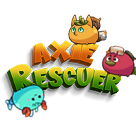

    
     
     
    <h1>🛡️ Axie Rescuer 🛡️</h1>
    
Rescue the Axies from a world overrun by zombies!

    
     
     

## [**Video Demo**](https://drive.google.com/uc?export=download&id=1pdjtDGlptNa0qzcKV7GhLLWHNtSJYSMw)

 
 

## 🌍 Story
The world of Axies has been taken over by zombies. Your mission? Save the trapped Axies!

    
    

 
 

## 🎮 Controls
- **Move**: WASD or Joystick
- **Rotate/Shoot**: Mouse or Right Stick

 
 

## 🧟‍♂️ Key Features
- **Rescue Missions**: Free Axies from dangerous zones.
- **Zombie Combat**: Use your weapon to shoot waves of zombies.
- **Fast-Paced Action**: Quick reflexes and strategy are your best weapons.

    

 
 

## 📥 How to Play
1. **Download** for [Android](https://drive.google.com/file/d/100Z6wPvswM0j9D4h9G8OO9ycCMebLe2z/view?usp=drive_link), [Desktop](https://drive.google.com/file/d/1ebX3G7S_D9akObhWZUAOjmxtvDSAu9Se/view?usp=drive_link).
2. **Start** your mission and save the Axies!
3. **Fight zombies** and complete all rescue missions.

 
 

**Good luck, hero! 🚀**
